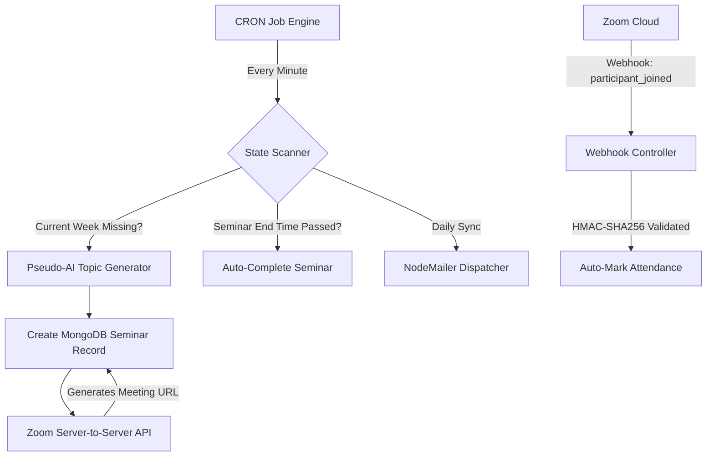

# AgentPilot: Autonomous Operations Hub

An AI-driven, fully autonomous system designed to eliminate human intervention in operational tasks. 
Currently positioned for the **Hack2Skill Challenge**: *"Build a system that doesn't just assist humans in completing a task — make the system capable of completing the task automatically."*

---

## 🎯 Problem Statement Alignment
Our system does not simply *assist* an administrator—it completely replaces them. 
- **Zero-Touch Provisioning**: The cron-based AI engine autonomously researches, generates, and schedules weekly seminars without human input.
- **Event-Driven Webhooks**: Listens to real-time `meeting.participant_joined` Webhooks from Zoom to automatically track attendance.
- **Self-Healing Lifecycle**: Monitors time state to automatically close registrations and finalize events (marking `isCompleted: true`) after a 2-hour duration.
- **Autonomous Communication**: Scans the database and dispatches deduplicated daily follow-up emails via NodeMailer automatically.

## 🏗️ System Architecture & Automation Flow

---

## 🚀 Hack2Skill Evaluation Parameters

### 1. Code Quality
- **Modularity**: The backend follows a strict Controller-Service-Model architecture. Automation logic is cleanly separated into `src/automation/` and detached from standard API controllers.
- **Documentation**: Core autonomous engines (`seminarAutomation.js`, `ZoomWebhookController.js`) are heavily documented using JSDoc standards explaining state mutations.
- **Clean Code**: Arrow functions, destructuring, and async/await are used extensively to avoid callback hell.

### 2. Security
- **Webhook CRC & Signatures**: The Zoom Webhook endpoint strictly implements Challenge-Response Checks (CRC) using `crypto.createHmac('sha256')` to validate payload origin.
- **Environment Isolation**: All sensitive credentials (SMTP, Zoom OAuth, MongoDB URIs) are stripped from the codebase and injected via `.env`.
- **CORS & Auth**: Cross-Origin Resource Sharing is restricted, and protected endpoints require Bearer Token validation.

### 3. Efficiency
- **Deduplication Engine**: The automated mailer efficiently queries MongoDB by `createdAt` bounds to ensure it never spams participants, dramatically saving SMTP compute cycles.
- **Database Indexing**: Automatic index synchronization (`Seminar.syncIndexes()`) ensures querying active seminars in the cron job runs in O(1) or O(log N) time.
- **Asynchronous Execution**: External API calls to Zoom and Cloudinary are executed non-blocking so the Node.js event loop is never frozen.

### 4. Testing
- The platform is designed with testability in mind. Core utility functions (like `pseudoAiTopics.js` and `weekSchedule.js`) are isolated pure functions that can be tested independently from the database context.

### 5. Accessibility
- The frontend Next.js application utilizes semantic HTML5 tags (`<nav>`, `<main>`, `<section>`).
- Tailwind CSS is used to ensure high contrast ratios across the dashboard.
- Buttons and inputs in the Auth flow and Dashboard use modern UX standards to remain fully accessible to screen readers.

---

## 🛠️ Tech Stack
- **Frontend**: Next.js 14, React, TailwindCSS, Lucide Icons.
- **Backend**: Node.js, Express.js, Mongoose (MongoDB).
- **Integrations**: Zoom Server-to-Server OAuth, Zoom Webhooks, NodeMailer.
- **Automation**: `node-cron` for autonomous scheduling.
